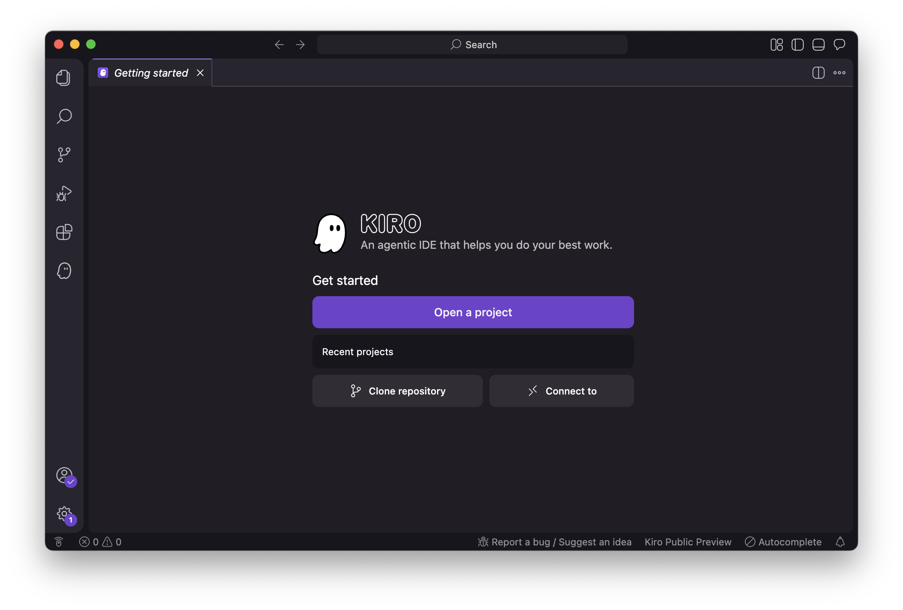
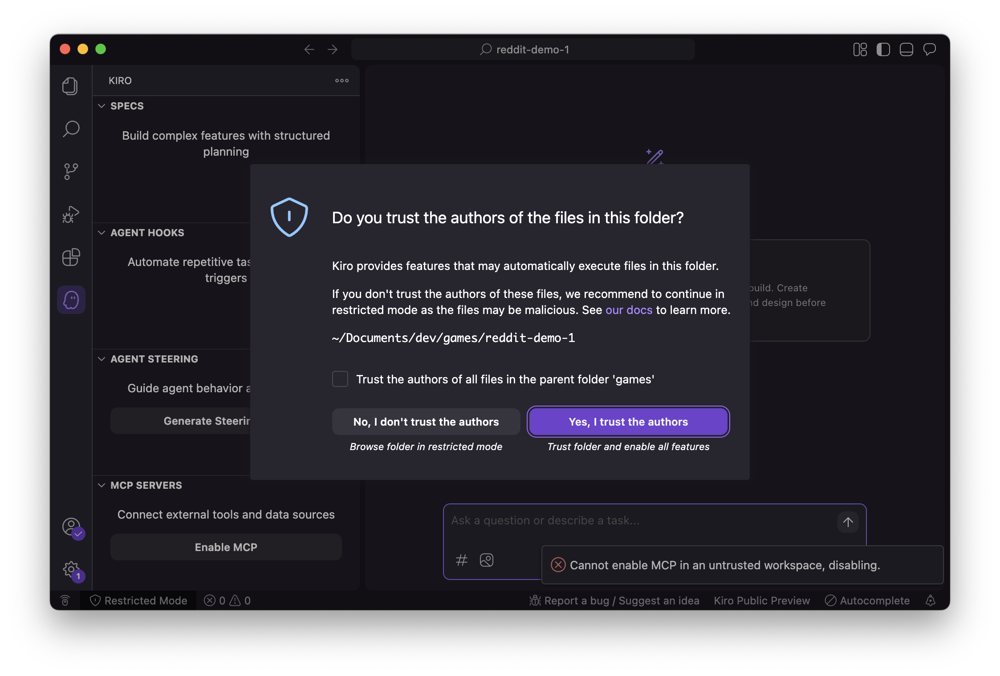
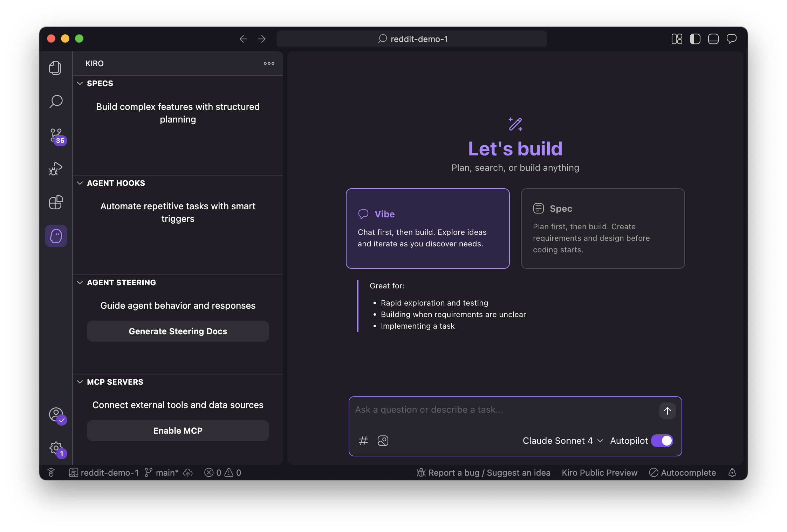
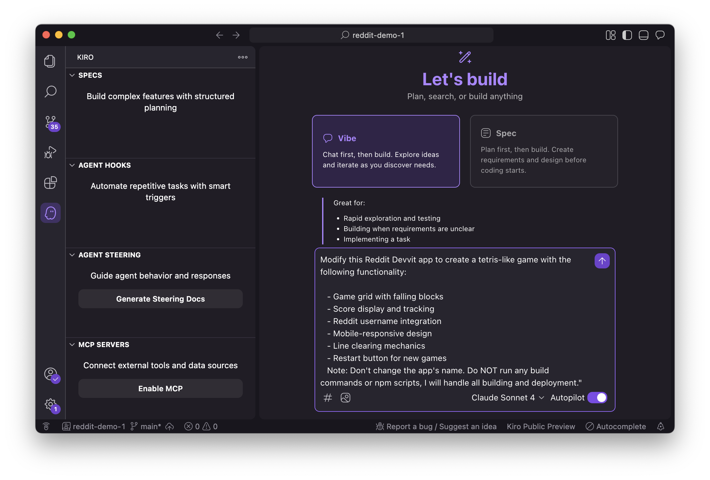
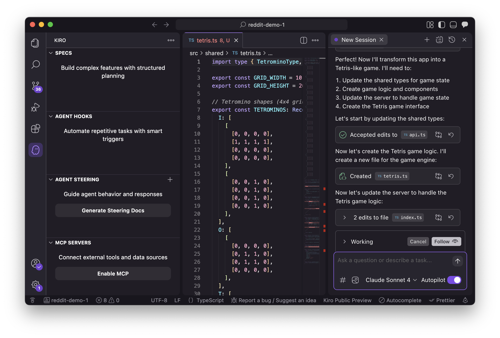
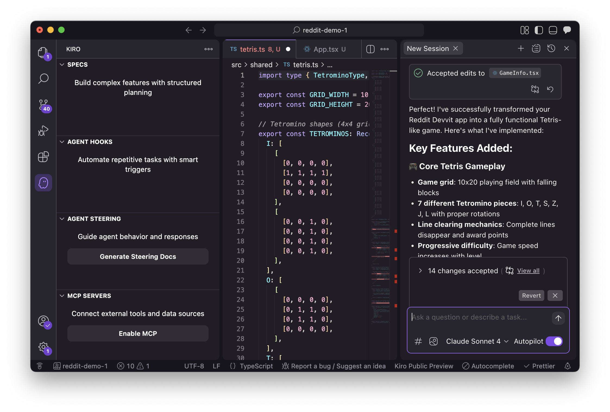
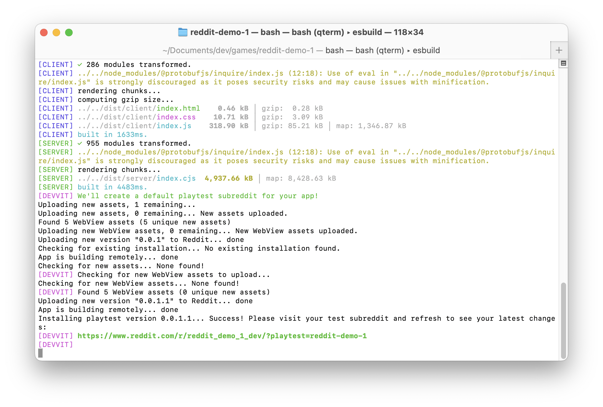
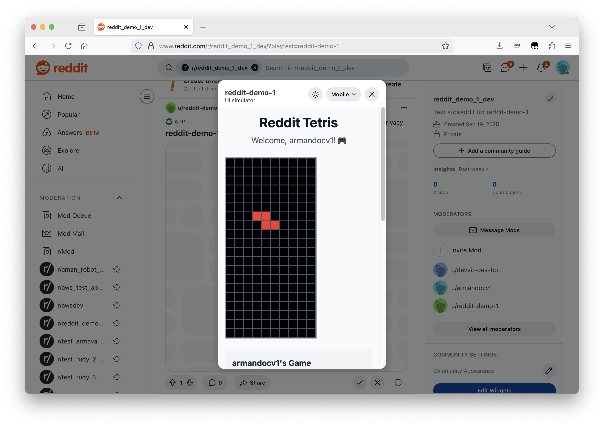

# Kiro Setup Guide

Kiro is an agentic IDE that helps you do your best work with AI-powered development features.

**Prerequisites:** You should have already created a Devvit project using the templates from [Step 1](step-01-devvit-templates.md).

## Installation

### Download and Install Kiro

1. Go to [kiro.dev/downloads](https://kiro.dev/downloads/) and download the installer
2. Open the downloaded file and follow installation instructions for your OS (Windows, macOS, or Linux)
3. Open Kiro IDE

### First Run Setup

1. **Login**: Choose from social or AWS login options
2. **Import Settings**: Optionally import VS Code settings and extensions
3. **Theme Selection**: Choose your preferred theme
4. **Shell Integration**: Allow Kiro to execute commands on your behalf

---

## 🎯 Kiro Steering Docs for Devvit Development

**Note**: Steering docs are already included in Reddit's Devvit templates, so this step is **optional and for reference only**. This section is for developers interested in understanding how Kiro uses steering docs to maintain consistent development patterns.

### What Are Steering Docs?

Kiro uses "steering docs" to maintain persistent knowledge about your project. These markdown files in `.kiro/steering/` ensure Kiro consistently follows Devvit patterns without needing to explain them in every conversation.

### What This Repository Provides

This repository includes pre-configured steering docs optimized for Reddit Devvit game development:

- **`general-best-practices.md`**: Development focus, scope management, test cleanup, Devvit workflow rules
- **`devvit-platform-guide.md`**: Reddit Devvit platform architecture, capabilities, limitations, and what to build

Both files are configured with `inclusion: always` (default), meaning Kiro automatically loads them in every interaction.

### What Kiro Will Automatically Do

With steering docs in place, Kiro will:
- ✅ Never change your project name (critical for Devvit deployment)
- ✅ Suggest `npm run dev` for testing instead of running it
- ✅ Keep implementations minimal and focused
- ✅ Preserve Devvit project structure (client/server/shared)
- ✅ Use `/api/` prefix for all server endpoints
- ✅ Avoid filesystem access and native packages
- ✅ Design for mobile-first experiences
- ✅ Handle errors appropriately

### Learn More

For more information about Kiro steering docs, visit [Kiro's official documentation](https://kiro.dev/docs).

---

## 🎮 Kiro Usage Example

### Step 1: Open Your Devvit Project

Navigate to your project directory and open it in Kiro:

```bash
cd my-devvit-app
kiro .
```

Or use **File > Open Folder** to select your project directory.



**Note:** Kiro may ask if you trust the authors of the files in this folder. Click "Yes" or "Trust" to proceed.



### Step 2: Create Your Game

1. Kiro's features panel with chat interface opens automatically
2. If you don't see it, click the **Kiro Ghost icon** in the activity bar (left sidebar)



Kiro offers two approaches for building features:

**Vibe (Recommended for Quick Development):**
- Direct, conversational approach
- Start building immediately without formal planning
- Best for rapid prototyping and simple features

**Spec (Alternative for Structured Development):**
- Formal requirements, design, and task phases
- Best for complex features requiring detailed planning

**Steps:**
```
1. Select the Vibe option in the panel
2. Enter your prompt: 
   "Modify this Reddit Devvit app to create a tetris-like game with the following functionality:
   
   - Game grid with falling blocks
   - Score display and tracking
   - Reddit username integration
   - Mobile-responsive design
   - Line clearing mechanics
   - Restart button for new games
   
   Note: Don't change the app's name. Do NOT run any build commands or npm scripts, I will handle all building and deployment."
3. Kiro starts building immediately based on your description
```



Kiro will start building your game step by step:



After completion, Kiro will show a summary of everything that was built:



### Step 3: Test Your Game

Run the development server to see your game in action:

```bash
npm run dev
```



Open the provided URL in your browser to play your Tetris-like game:



---

## 🎮 Using Kiro for Game Development

### 🏗️ Build Complete Game

**Example Prompt:**
```
Modify this Reddit Devvit app to create a clicker game with the following functionality:

- Large clickable button that increases score
- Score display with animated counter
- Upgrade system (auto-clicker, multipliers)
- Reddit username integration
- Mobile-responsive design

Note: Don't change the app's name. Do NOT run any build commands or npm scripts, I will handle all building and deployment.
```

💡 **Want more game ideas?** Check out [Game Examples & Templates](game-examples.md) for ready-to-use prompts.

---

## ⭐ Best Practices

- **Be Specific**: Include exact requirements and functionality in your prompts
- **Break Down Features**: Create detailed descriptions for complex game mechanics
- **Iterate with Chat**: Refine implementations through conversation
- **Test Frequently**: Build and test games regularly during development

## 🔧 Troubleshooting

**Installation Issues:**
- Verify system requirements for your OS
- Run installer as administrator (Windows) or with proper permissions

**Project Not Loading:**
- Ensure project directory contains valid code files
- Check file permissions in project folder
- Restart Kiro and try reopening project

**Authentication Problems:**
- Clear browser cache if using social login
- Verify AWS credentials if using AWS login
- Try alternative login method
