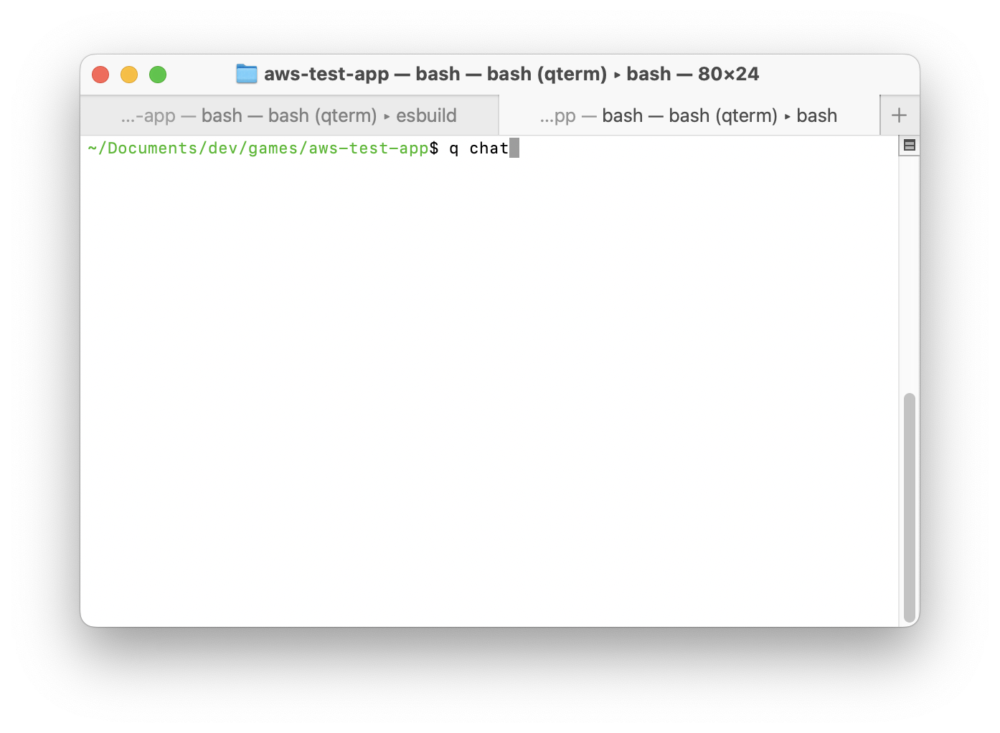
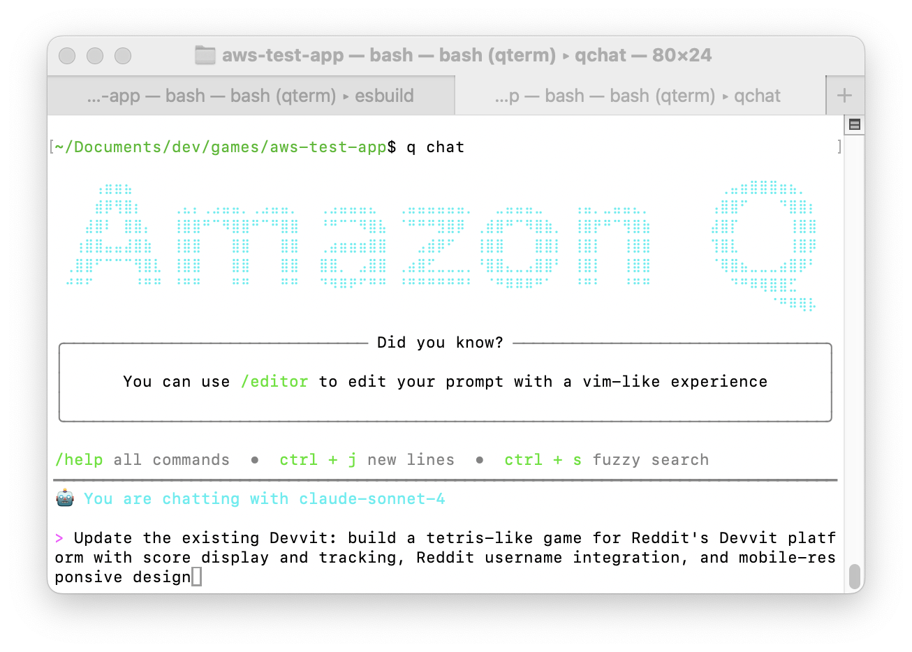
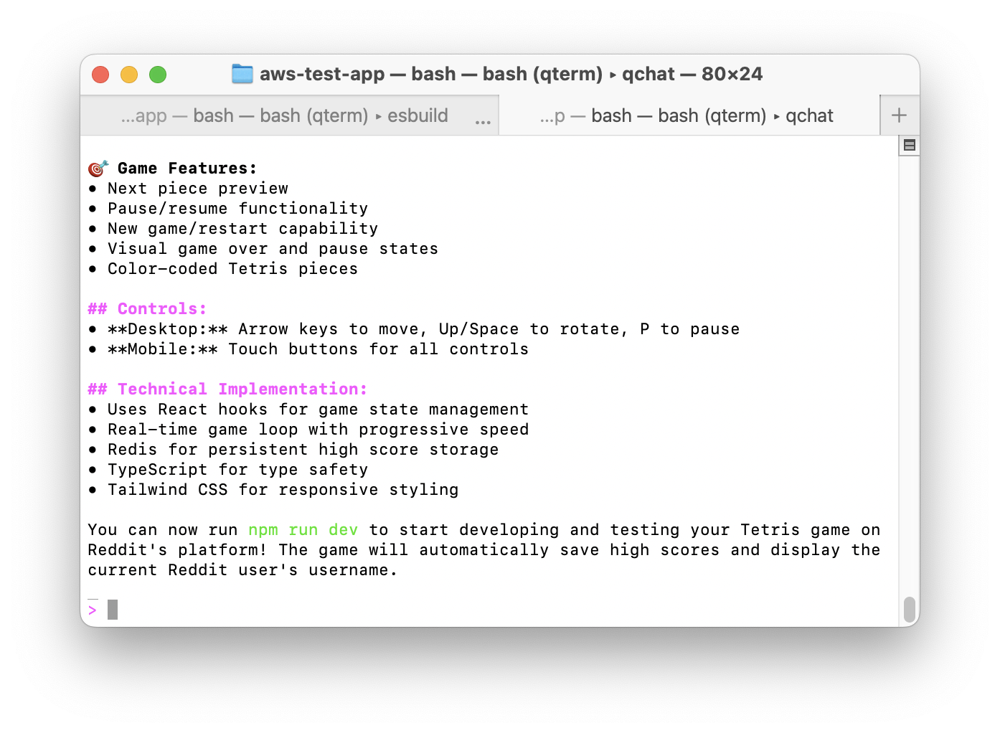
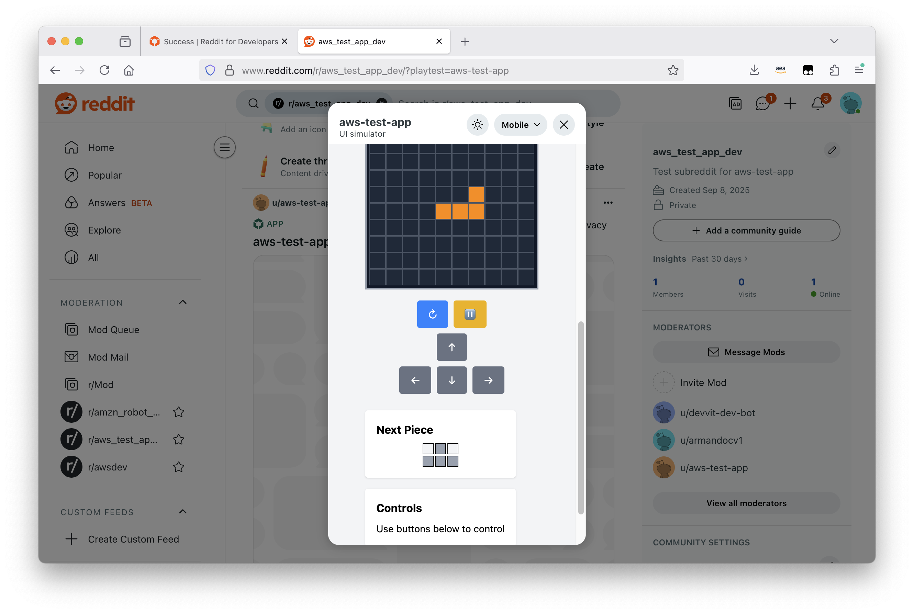

# Amazon Q Developer Setup Guide

Amazon Q Developer provides AI assistance for building games through two interfaces with different capabilities.

## Choose Your Interface

### Amazon Q CLI (Recommended for Advanced Workflows)
**Best for:** Complex projects, team collaboration, advanced context management

**Unique features:**
- Save/load conversations across sessions
- Custom agent configurations  
- Knowledge base for persistent context
- TODO list management
- Advanced file and AWS operations

### VS Code Extension (Best for IDE Integration)
**Best for:** In-editor coding assistance, quick questions

**Features:**
- Integrated chat sidebar in VS Code
- Code suggestions and completions
- Basic file operations

---

## Installation Options

### Option 1: Amazon Q CLI

```bash
# Install Amazon Q CLI
npm install -g @aws/amazon-q-developer-cli

# Authenticate
q auth login
```

### Option 2: VS Code Extension

1. Open VS Code
2. Go to Extensions (Ctrl+Shift+X)
3. Search for "Amazon Q"
4. Install the official Amazon Q extension
5. Sign in with your AWS account

---

## 🎮 CLI Usage Example

### Step 1: Start Q Chat from Project Directory

Navigate to your Devvit project directory and start Q chat:

```bash
cd my-devvit-app
q chat
```



### Step 2: Enter Your Game Prompt

Use a detailed prompt to build your game:

```
Update the existing Devvit project: build a tetris-like game for Reddit's 
Devvit platform with score display and tracking, Reddit username 
integration, and mobile-responsive design
```



### Step 3: Follow the AI Process

Amazon Q will implement your game step by step. You can either:
- Approve each individual step as prompted
- Trust all actions to let Q complete the entire process

After completion, Q will show a summary of everything that was built:



### Step 4: Test Your Game

Run the development server to see your game in action:

```bash
npm run dev
```

Open the provided URL in your browser to play your Tetris-like game:



---

## 🎮 Using Amazon Q for Game Development

### 🏗️ Build Complete Game

**Example Prompt:**
```
Help me build a complete clicker game for Reddit's Devvit platform with:
- Main game interface with clickable button
- Score display and tracking
- Upgrade system (auto-clicker, multipliers)
- Reddit username integration
- Mobile-responsive design
```

💡 **Want more game ideas?** Check out [Game Examples & Templates](game-examples.md) for ready-to-use prompts.

### 🐛 Debug and Troubleshoot Code

**Example Prompt:**
```
I'm building a clicker game for Devvit and encountering this error:
[paste error message]

Here's my code:
[paste relevant code section]

The error happens when [describe what you were doing].
Can you help me identify and fix the issue?
```

**Tips for better debugging support:**
- Include the complete error message
- Provide context about what you were trying to do
- Share relevant code sections, not entire files
- Mention it's for Devvit/Reddit platform

### 🔗 Reddit Integration

**Example Prompt:**
```
Help me integrate Reddit user data into my game leaderboard using Devvit context.
I need to:
- Get current user ID from context.userId
- Store scores in Redis
- Display top 10 players
- Handle anonymous users
```

### 🎨 Styling Games

**Example Prompt:**
```
Generate CSS for a retro-style game interface with:
- Neon colors (#00ff00, #ff0080)
- Pixel-perfect buttons with hover effects
- Animated score counters
- Mobile-responsive grid layout
- Dark theme background
```

## ⭐ Best Practices

- **Be specific**: Include exact requirements in your prompts
- **Iterate**: Ask Q to modify generated code based on your needs
- **Context matters**: Mention you're building for Devvit/Reddit
- **Test frequently**: Build complete games and test all functionality together

## 💻 Common Commands

```bash
# Start Q chat session
q chat

# Get help on commands
/help

# Review code for issues
q review src/
```

## 🔧 Troubleshooting

**Authentication Issues:**
```bash
q auth logout
q auth login
```

**Extension Not Working:**
- Restart VS Code
- Check AWS account permissions
- Verify internet connection
