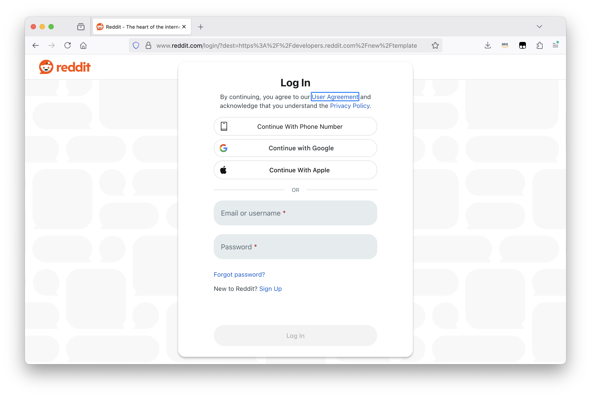
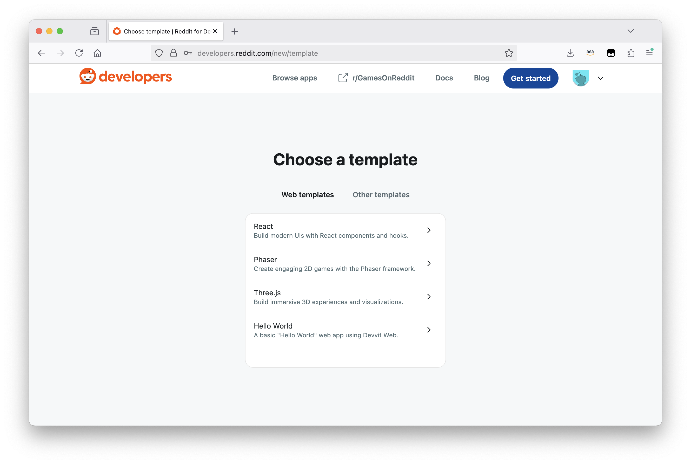
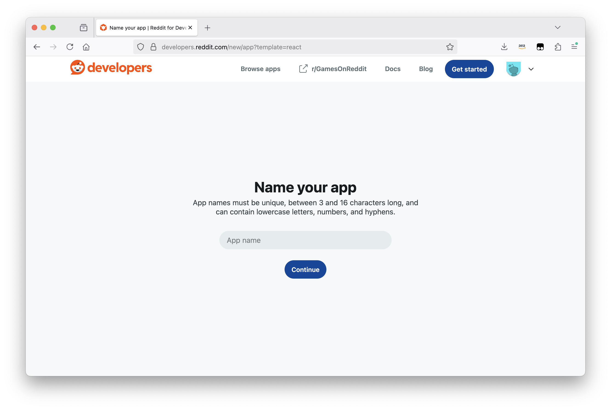
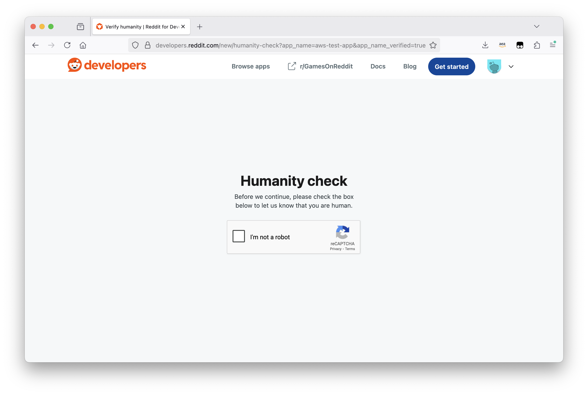
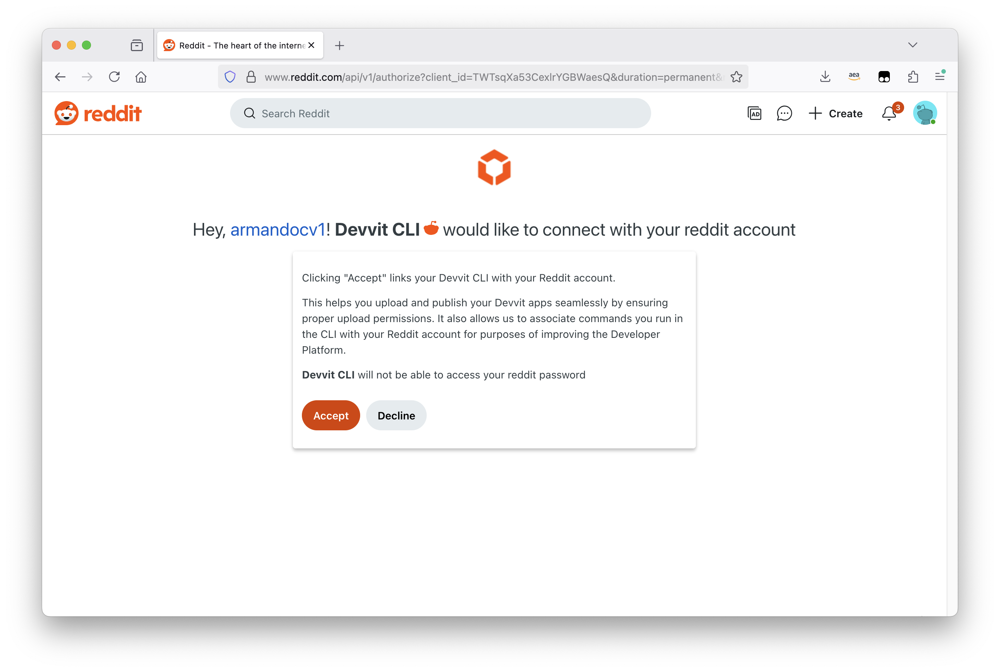
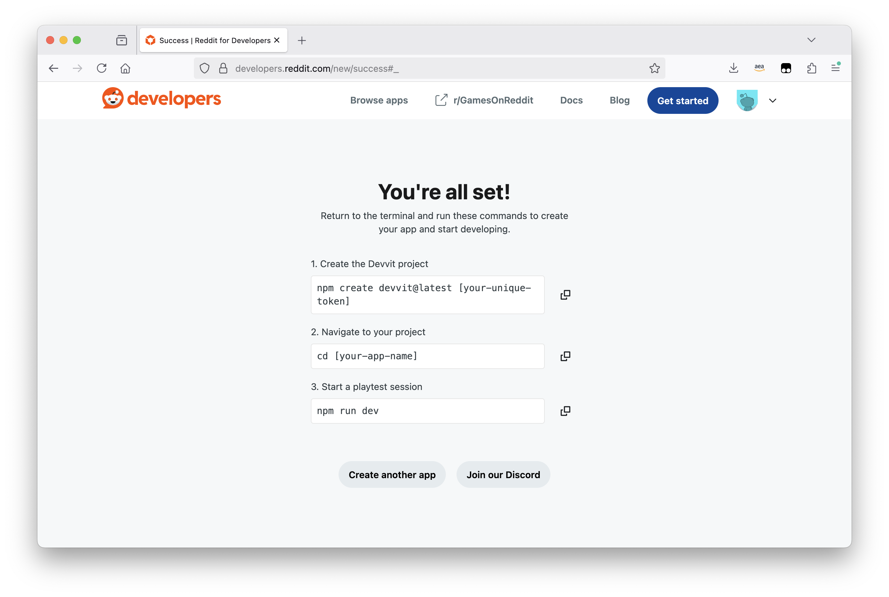
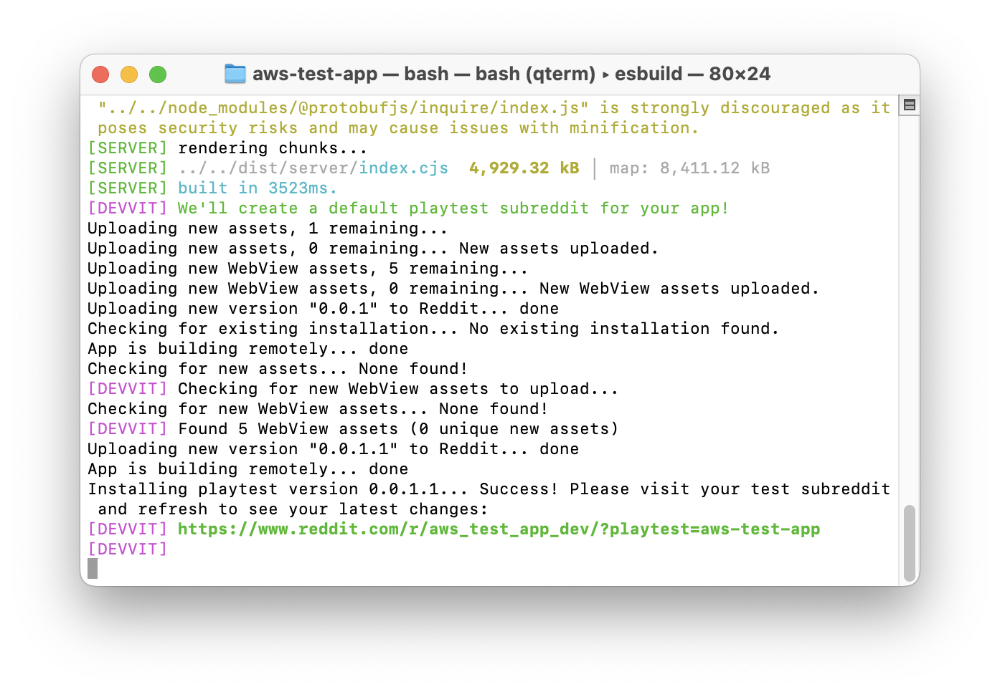
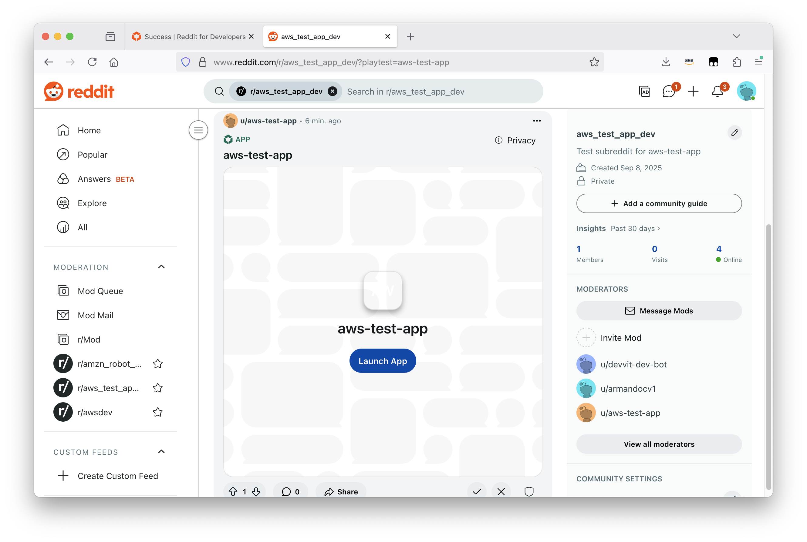

# Step 1: Choose a Devvit Template

## Access Reddit Developer Portal

1. Go to [developers.reddit.com/new/template](https://developers.reddit.com/new/template)
2. Login with your Reddit account (create one if needed)



## Available Templates

**React starter** - Boilerplate with React, Vite, Tailwind, TypeScript  
**Three.js starter** - 3D graphics and games with Three.js  
**Phaser starter** - 2D game framework with physics and animations  
**Hello world** - Simple counter app, no frameworks



## Template Selection Process

### 1. Choose your template based on game type

### 2. Enter your app name when prompted



### 3. Complete "I'm not a robot" verification (if shown)



### 4. Confirm Reddit account connection when prompted



### 5. Copy the commands from "You're all set!" page



## Terminal Commands

**Return to the terminal and run these commands to create your app and start developing.**

After template selection, you'll see three commands:

1. **Create project**: `npm create devvit@latest [your-unique-token]`
2. **Navigate**: `cd [your-app-name]`
3. **Start development**: `npm run dev`

## Success Confirmation

On success, you should see something like this:

```
Your Devvit authentication token has been saved to /Users/user.name/.devvit/token
Fetching and extracting the template...
Cutting the template to the target directory...
 🔧 Installing dependencies...
 🚀🚀🚀 Devvit app successfully initialized!
┌────────────────────────────────────────────────────┐
│ • `cd my-app` to open your project directory       │
│ • `npm run dev` to develop in your test community  │
└────────────────────────────────────────────────────┘
```

## Launch Your Application

To run your app, `cd my-app` and then run `npm run dev`. You should see some logs start up that finish with:

```
✨ https://www.reddit.com/r/my-app_dev?playtest=my-app
```

Copy the URL from the terminal as seen below. The URL is generated based on your app name.



The dev command automatically creates a development subreddit for your app and a test post for you to develop against. When you open that link in your browser, it should look something like this:



Click the Launch App button to see your app!

## Project Structure

Your new Devvit project contains these key folders:

- **`src/client`** - Frontend code (React, Vue, Angular, etc.)
- **`src/server`** - Backend API code (Express.js, persistence, real-time features)
- **`src/shared`** - Shared types and interfaces between client/server
- **`devvit.json`** - Reddit-specific configurations and services
